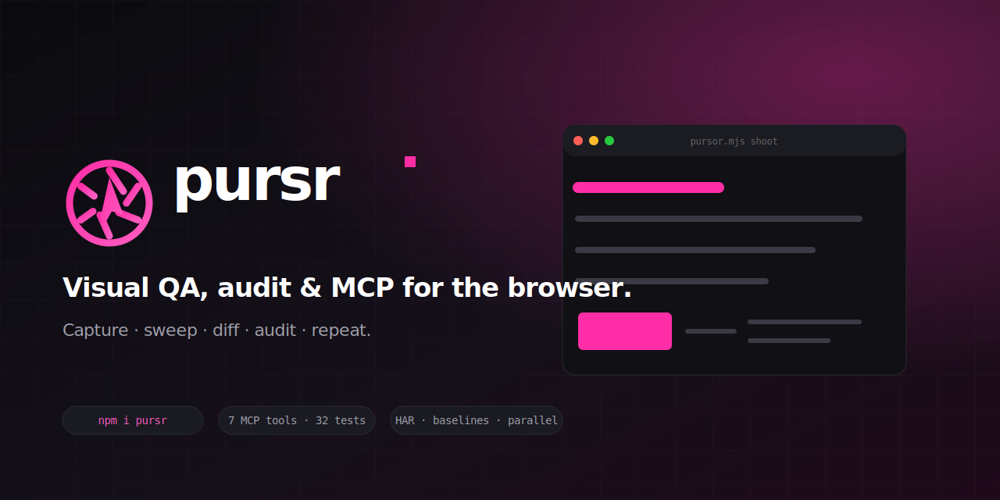

<!-- PROJECT_LOGO_START -->
<p align="center">
  
</p>

<p align="center">
  
</p>

<h1 align="center">pursr</h1>

<p align="center">
  <strong>Visual QA, audit, and MCP for the browser.</strong><br>
  Capture - sweep - diff - audit - repeat - from the CLI, an MCP server, or as a library.
</p>

<p align="center">
  <a href="https://www.npmjs.com/package/pursr"></a>
  <a href="https://github.com/0xheycat/pursr/blob/main/LICENSE"></a>
  <a href="https://www.npmjs.com/package/pursr"></a>
  <a href="https://github.com/0xheycat/pursr/actions"></a>
  <a href="https://nodejs.org"></a>
</p>

<p align="center">
  <a href="#install">Install</a> &middot; <a href="#30-seconds">30 seconds</a> &middot; <a href="#cli">CLI</a> &middot; <a href="#mcp-server">MCP</a> &middot; <a href="#library-api">Library</a> &middot; <a href="#plugins">Plugins</a> &middot; <a href="#roadmap">Roadmap</a>
</p>

---

## Why pursr?

Most teams need **five separate tools** to do visual QA: a screenshot CLI, a regression diff runner, an accessibility auditor, a way to share captures with an AI assistant, and a way to **turn all of that into a PDF report** for stakeholders. **pursr is all five** - built as a single Node.js package with:

- **A unified CLI** (`pursr`) for every capture, diff, sweep, and audit.
- **An agent-grade MCP stdio server** (`pursr-mcp`) built on the official Model Context Protocol SDK, with persistent tabs, direct image responses, rendered-state inspection, actions, diagnostics, screenshots, sweeps, and resources.
- **Visual Operator** sessions with a rendered cursor, target labels, click markers, visible Chrome windows, and authenticated Chrome attachment over CDP.
- **A library API** with 25 subpath modules, so you can embed the browser and QA primitives in your own tooling.
- **A plugin system** for custom viewports, sweep ops, and capture hooks.
- **PDF reports + AI diff summaries** built in - render a sweep to a styled PDF or ask a vision LLM to describe the regression in plain language.
- **Zero browser bundled** - drives your system Chrome via Playwright. No 200 MB Chromium download.

## Install

```bash
npm install pursr
npm install --save-dev playwright-core   # peer dep - bring your own Chrome
```

Then verify:

```bash
pursr viewports         # list 10+ registered viewport presets
pursr probe https://example.com   # health check
```

## 30 seconds

```bash
# 1. Capture a screenshot with overlays
pursr shoot https://example.com shot.png \
  --preset desktop-1280 --grid --grid-tile 64

# 2. Save it as a visual baseline
pursr baseline save myapp shot.png home --url https://example.com

# 3. Next time you run, compare against the baseline
pursr diff https://example.com \
  ~/.pursr/baselines/myapp/<id>/home.png \
  diff.png

# 4. Or: run a batched sweep + a11y audit + parallel workers
pursr sweep ./plan.json   # see plans/ for an example
```

## Features

| Feature | Description | CLI flag |
| --- | --- | --- |
| Multi-viewport capture | 10+ presets (mobile, tablet, desktop, ultrawide) | `--preset mobile-375` |
| Layered states | entity / terrain / hud / ui isolation | `--layer entity` |
| Animation freeze | pause CSS/JS animations for stable frames | `--no-animation` |
| Cursor overlay | pointer / grab / grabbing / crosshair | `--cursor crosshair` |
| Visual Operator | rendered cursor, target labels, click markers, WebM recording, headed and CDP sessions | `operator` CLI + MCP session tools |
| Grid overlay | spacing guides, custom color + tile size | `--grid --grid-tile 64` |
| Camera control | zoom + pan via mouse wheel/drag | `--zoom 1.5 --panX 200` |
| Frame timeline | N captures at intervalMs for animations | `pursr frames <url> 8 200` |
| Hover capture | text=/role=/aria=/placeholder= matchers | `pursr hover <url> "text=Login"` |
| Pixel diff | `pixelmatch` against any reference PNG | `pursr diff <url> <ref>` |
| Visual baselines | save / approve / diff with stable IDs | `pursr baseline save ...` |
| Parallel sweep | opt-in worker pool across independent steps | `{ "parallel": 4 }` |
| Accessibility audit | axe-core WCAG 2.1 AA + highlighted screenshot | `pursr audit <url>` |
| DOM snapshot | serialized HTML + computed styles + selector map | `pursr dom <url>` |
| Sweep plans | JSON-driven batch with per-step ops | `pursr sweep plan.json` |
| HTML report | dark-themed grid of every capture + meta | auto-generated `index.html` |
| CI output | JUnit XML, GitHub Actions annotations, Markdown | written on every sweep |
| Auto-heal selectors | fallback chain + named matchers | `["text=Login", "#login"]` |
| HAR capture | HAR 1.2 spec, written next to your shot | `--har ./req.har.json` |
| Auth state | Playwright storageState, reuse logged-in sessions | `--auth-state admin` |
| Plugins | custom viewports, sweep ops, before/after hooks | `pursr-plugin-*` |
| MCP server | Official MCP SDK transport, 16 tools, and resources for Claude/Cursor/Codex | `npx pursr-mcp` |
| PDF report | render sweep.json to a styled, embedded-PNG A4 PDF | `pursr report --sweep ./sweep.json` |
| AI diff summary | vision LLM describes the diff in plain language | `pursr diff ... --ai` |

## CLI

```bash
# Health check
pursr probe https://example.com

# Screenshot (simple)
pursr shot https://example.com ./out/shot.png

# Rich capture: viewport preset + cursor + grid
pursr shoot https://example.com \
  --preset desktop-1280 \
  --cursor crosshair \
  --grid --grid-tile 64

# Isolate a layer
pursr layer https://example.com entity

# Animation timeline
pursr frames https://example.com 8 200 ./frames/

# Hover an element
pursr hover https://example.com "text=Login"

# Pixel diff vs reference
pursr diff https://example.com ./ref.png ./out/diff.png

# Batched plan
pursr sweep ./plan.json

# Accessibility audit
pursr audit https://example.com --tags wcag2a,wcag2aa

# DOM + selector map snapshot
pursr dom https://example.com

# HAR capture during a shoot
pursr shoot https://example.com shot.png --har ./req.har.json

# Auth state reuse
pursr shoot https://my.app/dashboard shot.png \
  --auth-state admin --auth-project myapp

# Visual baselines
pursr baseline save myapp shot.png home --url https://example.com
pursr baseline list myapp
pursr baseline approve myapp ./new.png home --url https://example.com

# Plan validation
pursr validate ./plan.json
```

### Subcommands

| Subcommand | Purpose |
| --- | --- |
| `probe` | Health check (HTTP status, page title) |
| `shot` / `full` | Viewport / full-page screenshot |
| `eval` | Execute JS in the page, return result |
| `click` / `type` / `wait` / `seq` | Interaction primitives |
| `operator` | Run a visible action plan with cursor feedback, screenshot, trace, diagnostics, and optional WebM video |
| `diff` | Pixel-level diff vs a reference PNG |
| `viewports` | List all registered viewport presets |
| `shoot` | Rich capture (overlays, freeze, camera, plugins) |
| `layer` | Capture one isolated layer (entity/hud/ui/terrain) |
| `frames` | N-frame animation timeline at interval |
| `hover` | Hover state capture |
| `sweep` | Batched capture plan -> HTML report + CI output |
| `audit` | axe-core WCAG accessibility audit + highlighted screenshot |
| `dom` / `dom-snapshot` | Serialized DOM + CSS selectors + XPath + bounding rects |
| `every-viewport` | Capture once per preset in parallel (3-wide pool) |
| `baseline` | save / list / approve / show visual baselines |
| `auth` | save / load / list / delete Playwright storageState |
| `validate` | Validate a sweep plan JSON without running it |

## MCP Server

`pursr-mcp` exposes every capability as MCP tools over stdio - works with Claude Code, Cursor, Continue, and any MCP host.

```bash
npx pursr-mcp
# or with verbose logging:
npx pursr-mcp --verbose
```

### Exposed Tools

| Tool | Description |
| --- | --- |
| `pursr_session_open` | Open a headless, visible, or CDP browser session with optional Visual Operator |
| `pursr_sessions` | List active browser sessions |
| `pursr_snapshot` | Visible rendered nodes, geometry, semantics, and computed styles |
| `pursr_act` | Interact plus move cursor, annotate targets, and clear visual feedback |
| `pursr_screenshot` | Return the current PNG directly to the vision model |
| `pursr_inspect` | Inspect exact geometry, computed styles, and stacking ancestors |
| `pursr_diagnostics` | Read console, page errors, failed requests, and HTTP failures |
| `pursr_session_close` | Close the tab and release its browser process |
| `pursr_shoot` | Rich screenshot capture (viewport, grid, layer, cursor, camera, animation freeze, HAR) |
| `pursr_diff` | Pixel-diff a URL against a reference PNG |
| `pursr_sweep` | Execute a batch sweep plan |
| `pursr_frames` | Capture an N-frame animation timeline |
| `pursr_probe` | Health-check a URL |
| `pursr_audit` | axe-core WCAG audit + highlighted screenshot |
| `pursr_dom_snapshot` | Full DOM + selector map snapshot |
| `pursr_check` | CI visual regression check against a stable baseline |

### Agent workflow

Use persistent sessions for the same inspect-act-verify loop as an interactive browser agent:

1. Call `pursr_session_open` once with a stable `sessionId`.
2. Call `pursr_snapshot` to understand the rendered page before acting.
3. Use `pursr_act` for a small, ordered interaction sequence.
4. Call `pursr_screenshot` when visual judgment matters; the model receives the PNG directly.
5. Use `pursr_inspect` for layout, clipping, typography, or stacking problems.
6. Read `pursr_diagnostics`, then reload and verify after source changes.
7. Call `pursr_session_close` when the review is complete.

Example action arguments:

```json
{
  "sessionId": "farm",
  "actions": [
    { "type": "hover", "selector": "role=button|Build" },
    { "type": "click", "selector": "text=Barn" },
    { "type": "wait", "selector": "role=dialog" }
  ]
}
```

### Visual Operator

Set `visual: true` to render the agent cursor and interaction feedback into screenshots. `mode: "visible"` enables it automatically and opens a Chrome window that a developer can watch.

#### CLI: scripted tutorials and repeatable recordings

Use the CLI when the steps are already known. It needs no MCP host and produces a final screenshot, JSON trace, diagnostics, and an optional WebM recording.

```bash
pursr operator http://localhost:3000 @plans/operator-tutorial.json \
  --visible \
  --start-delay 3000 \
  --slow-mo 100 \
  --video ./recordings \
  --out ./recordings/final.png
```

The action plan is a JSON array. The same action objects work through `pursr_act` in MCP:

```json
[
  { "type": "annotate", "selector": "role=button|Build", "label": "Open build menu" },
  { "type": "click", "selector": "role=button|Build", "durationMs": 350, "settleMs": 500 },
  { "type": "click", "x": 640, "y": 420, "durationMs": 250 },
  { "type": "drag", "fromX": 520, "fromY": 400, "toX": 760, "toY": 520, "steps": 30 },
  { "type": "keyDown", "key": "Shift" },
  { "type": "keyUp", "key": "Shift" },
  { "type": "press", "key": "Escape" },
  { "type": "sleep", "ms": 800 },
  { "type": "clearAnnotations", "keepCursor": true }
]
```

Chrome records the browser viewport as silent WebM video. Add narration or system audio in your editor, and convert to MP4 when needed:

```bash
ffmpeg -i recording.webm -c:v libx264 -pix_fmt yuv420p tutorial.mp4
```

#### MCP: adaptive agent operation

Use MCP when the agent must inspect the current page, decide the next action, verify visual results, or pause for human approval. MCP is not required for CLI recording. Both interfaces use the same session and Visual Operator engine.

```json
{
  "url": "http://localhost:3000",
  "sessionId": "visual-review",
  "mode": "visible",
  "operatorColor": "#ff2ea6",
  "slowMo": 80
}
```

Add `recordVideoDir` to record an MCP session in headless or visible mode. The final video path is returned by `pursr_session_close`. CDP sessions preserve an existing browser profile but cannot record video because Chrome owns that context.

Visual actions use the regular `pursr_act` tool:

```json
{
  "sessionId": "visual-review",
  "actions": [
    { "type": "move", "x": 640, "y": 360, "durationMs": 300 },
    { "type": "annotate", "selector": "role=button|Publish", "label": "Primary CTA" },
    { "type": "click", "selector": "role=button|Publish" },
    { "type": "clearAnnotations", "keepCursor": true }
  ]
}
```

To use an existing authenticated Chrome profile, start Chrome with a dedicated remote-debugging profile and attach using CDP. Do not expose the debugging port beyond localhost.

```bash
chrome --remote-debugging-port=9222 --user-data-dir=/tmp/pursr-chrome
```

```json
{
  "url": "https://app.example.com",
  "sessionId": "signed-in-review",
  "mode": "cdp",
  "cdpUrl": "http://127.0.0.1:9222",
  "visual": true
}
```

Pursr opens a new tab in Chrome's default context, preserving that profile's cookies and login state. Closing the Pursr session disconnects without terminating the owner browser.

### Exposed Resources

| URI | Description |
| --- | --- |
| `pursr://shoot/<url|preset>` | Last screenshot PNG (image/png) |
| `pursr://sweep/<plan-name>` | Last sweep summary JSON (application/json) |

Resources are persisted to `~/.pursr/mcp/mcp-index.json` (override with `PURSR_MCP_STATE`).

## Visual Regression Baselines

```bash
pursr baseline save myapp ./out/shoot.png home --url https://my.app
pursr baseline approve myapp ./out/shoot.png home --url https://my.app
pursr baseline list myapp
pursr baseline show myapp home --url https://my.app
```

Baselines live under `~/.pursr/baselines/<project>/<id>/<step>.png` + `manifest.json`. Override with `PURSR_BASELINES_DIR`. The `id` is a 16-char SHA1 prefix of `url|viewport|flags` so re-running a sweep maps to the same slot deterministically.

```js
import { diffKey, saveBaseline, loadBaseline } from "pursr/baseline";
const id = diffKey({ url: "https://my.app", viewport: { width: 1280, height: 800, dpr: 1 }, flags: { preset: "desktop-1280" } });
saveBaseline({ project: "myapp", id, step: "home", png: "./shot.png", meta: { url: "https://my.app" } });
```

## Sweep Plan Validation

```bash
pursr validate ./plan.json
# { "valid": false, "errors": ["steps[2].frames.count: must be a number between 1 and 120"] }
```

Catches: empty steps, unknown ops, out-of-range numbers, duplicate names, missing required fields. `pursr sweep` runs the same validator before executing - fail-fast.

```json
{
  "name": "homepage-matrix",
  "base": "https://example.com",
  "parallel": 4,
  "steps": [
    { "name": "baseline",   "shoot":  { "preset": "desktop-1280" } },
    { "name": "grid-64",    "shoot":  { "preset": "desktop-1280", "grid": true, "grid-tile": 64 } },
    { "name": "tablet",     "shoot":  { "preset": "tablet-768" } },
    { "name": "mobile",     "shoot":  { "preset": "mobile-375" } },
    { "name": "hover-cta",  "hover":  { "selector": ["text=Get started", "a.btn-primary"] } },
    { "name": "audit",      "audit":  { "tags": "wcag2a,wcag2aa" } },
    { "name": "diff",       "diff":   { "ref": "baseline" } }
  ]
}
```

## HAR Capture

```bash
pursr shoot https://example.com shot.png --har ./out/req.har.json
```

```js
import { startHarCapture, stopHarCapture, writeHar } from "pursr/har";
const state = await startHarCapture(page);
await page.goto(url);
const har = stopHarCapture(page);
await writeHar(har, "./out/req.har.json");
```

Output is HAR 1.2 spec - pipe to `har-cli`, perf-tools, or any visualizer.

## Auth State

```bash
pursr auth save myapp admin --from ./playwright-state.json
pursr shoot https://my.app/dashboard shot.png --auth-state admin --auth-project myapp
pursr auth list myapp
pursr auth load myapp admin --out ./round-trip.json
pursr auth delete myapp admin
```

States live in `~/.pursr/auth/<project>/<name>.json` (override with `PURSR_AUTH_DIR`). The on-disk format is the standard Playwright `storageState` shape: `{ cookies, origins }`.

## Parallel Sweep

Add `parallel: N` to your plan to run steps concurrently in a worker pool:

```json
{
  "name": "matrix",
  "base": "https://my.app",
  "parallel": 4,
  "steps": [
    { "name": "home",    "shoot": { "preset": "desktop-1280" } },
    { "name": "pricing", "shoot": { "preset": "desktop-1280" } },
    { "name": "docs",    "shoot": { "preset": "desktop-1280" } }
  ]
}
```

Steps run in a shared browser context; results are still ordered by index in the summary. Defaults to serial (`parallel: 1`) - opt in only when steps are independent.

## Accessibility Audit

```bash
pursr audit https://example.com --tags wcag2a,wcag2aa
# Writes: audit.json, audit-summary.md, audit-highlighted.png
```

Injects axe-core, runs a configurable tag set (`wcag2a`, `wcag2aa`, `wcag21a`, `wcag21aa`, `best-practice`), and overlays a red outline on every violating node with the rule id as a label. The summary Markdown includes per-rule failure snippets.

## DOM Snapshot

```bash
pursr dom https://example.com
# Writes: dom-snapshot-<ts>.dom.json
```

Captures serialized HTML, computed CSS for every visible element, and a selector map (`id`, `role`, `accessible name`, `text`, `xpath`, `css selector`, viewport-relative `rect`). Great for regression diffing without re-running a browser.

## CI Output

Every sweep writes three sidecar artifacts alongside `sweep.json`:

- `sweep.junit.xml` - JUnit XML for Jenkins / GitLab / CircleCI
- `sweep.github.json` - GitHub Actions annotation file
- `sweep.md` - Human-readable Markdown summary with diffs + failures

## Library API

```js
import {
  runProbe, runShot, runShoot, runSweep, runDiff, runAudit,
  captureDomSnapshot, resolveHealedSelector,
  saveBaseline, diffKey,
  startHarCapture, stopHarCapture, writeHar,
  loadAuthState,
  PursrMCPServer, loadMcpConfig, BrowserSessionManager,
  installVisualOperator, moveVisualCursor, highlightVisualTarget,
  validateSweepPlan,
  listResources, readResource,
  listViewports, resolveViewport, VIEWPORTS,
  loadPlugins, registerPlugin, getSweepOp,
  VERSION,
} from "pursr";
```

### Subpath exports

```js
import { resolveLocator } from "pursr/selector";
import { launch } from "pursr/runway";
import { parseFlags, asNum } from "pursr/util";
import { overlayGrid } from "pursr/overlays";
import { captureDomSnapshot } from "pursr/dom-snapshot";
import { runAudit } from "pursr/plugin-audit";
import { resolveHealedSelector } from "pursr/selector-heal";
import { writeCiOutput } from "pursr/ci-output";
import { diffKey, saveBaseline, loadBaseline } from "pursr/baseline";
import { validateSweepPlan } from "pursr/sweep-schema";
import { startHarCapture, stopHarCapture } from "pursr/har";
import { saveAuthState, loadAuthState } from "pursr/auth";
import { listResources, readResource } from "pursr/mcp-resources";
import { PursrMCPServer } from "pursr/mcp";
import { BrowserSessionManager } from "pursr/session";
import { moveVisualCursor, highlightVisualTarget } from "pursr/visual-operator";
```

## Plugins

A plugin is a plain ES module that exports a default object:

```js
// plugins/my-plugin.js
export default {
  name: "my-plugin",
  viewport: { "my-laptop": { width: 1440, height: 900, dpr: 2, label: "MBP 14" } },
  sweepOp: {
    lighthouse: async (ctx, opts) => { /* ... */ },
  },
  beforeShoot: async (ctx) => { /* mutate ctx.flags / ctx.viewport */ },
  afterShoot:  async (ctx, meta) => { /* augment sidecar */ },
  flagHelp:    { "my-flag": "what it does" },
};
```

Plugins are auto-loaded from `plugins/` (built-in) or via `--plugin <path>`.

## Architecture

```
src/
  index.js          - public library entry
  mcp.js            - official MCP SDK stdio server
  session.js        - persistent headless, visible, and CDP sessions
  visual-operator.js - rendered cursor and interaction feedback
  shoot.js          - runShoot (overlays + camera + frame-stable)
  sweep.js          - runSweep (validated, parallel pool)
  diff.js           - pixelmatch wrapper
  plugin-audit.js   - axe-core injection + highlighted screenshot
  dom-snapshot.js   - full DOM + CSSOM + selector map
  selector-heal.js  - auto-heal chain resolver
  ci-output.js      - JUnit / GitHub / Markdown
  baseline.js       - visual regression storage
  har.js            - HAR 1.2 network capture
  auth.js           - Playwright storageState
  sweep-schema.js   - plan validator
  mcp-resources.js  - MCP resources adapter
  overlays.js       - page-side CSS overlays + camera
  runway.js         - Playwright launcher + system-Chrome detector
  viewport.js       - built-in viewport presets
  selector.js       - text=/role=/aria=/placeholder= parser
  plugin.js         - plugin registry + hook runner
  util.js           - flags, args, hashing, HTML escape, renderSweepHtml
  every-viewport.js - one shot per preset in parallel
  frames.js, hover.js, shot.js, eval.js, probe.js, interact.js
```

## Development

```bash
git clone https://github.com/0xheycat/pursr
cd pursr
npm install
npm install --save-dev playwright-core
npm test
```

`npm test` runs 63 unit + integration tests (Node's built-in test runner, zero test deps). Coverage includes: viewport resolution, flag parsing, selector parsing, HTML escaping, hashing, baseline storage, sweep-plan validation, MCP resources, HAR 1.2 shape, auth state, and end-to-end CLI smoke tests.

```
src/           - 29 modules
test/          - 63 tests, 0 failures
plugins/       - 2 built-in plugins, auto-loaded
```

## Roadmap

- [x] Visual baselines (save / approve / diff)
- [x] Sweep plan schema validation
- [x] MCP resources (browse past captures from your AI host)
- [x] HAR 1.2 capture
- [x] Auth state (Playwright storageState)
- [x] Parallel sweep workers
- [x] Watch mode (`pursr watch <url>`)
- [x] Component-level snapshot (`pursr snap <selector>`)
- [x] PDF report export (`pursr report --sweep`)
- [ ] Cloud output adapters (S3 / GCS)
- [x] AI diff summary (vision model, `--ai`)

## PDF Report (v0.6.0)

Turn any sweep summary into a styled, self-contained A4 PDF you can email, attach to a PR, or hand to a designer.

```bash
# 1. Run a sweep (writes sweep.json + index.html + per-step PNGs)
pursr sweep ./plans/marketing.json

# 2. Generate a PDF from the most recent sweep
pursr report --sweep ./out/sweep-marketing/sweep.json --out ./out/report.pdf

# Or: skip image embedding for a tiny text-only report
pursr report --sweep ./out/sweep-marketing/sweep.json --no-embed
```

The PDF includes a colored header (pursr brand magenta), a summary stat grid (steps / passed / failed / total time), and a per-step card with: status badge, op + duration + URL, the embedded capture PNG, diff stats, audit violation count, and any error message. Page numbers in the footer.

Library:

```js
import { renderSweepPdf } from "pursr/report";
import { readFileSync } from "node:fs";

const summary = JSON.parse(readFileSync("./sweep.json", "utf8"));
const bytes = await renderSweepPdf(summary, { out: "./report.pdf" });
console.log("wrote", bytes.length, "bytes");
```

## AI Diff Summary (v0.6.0)

Add `--ai` to `pursr diff` and a vision LLM describes the differences in plain language alongside the pixel-diff percentage. Perfect for triaging a regression without opening the PNG.

```bash
# Basic
pursr diff https://my.app ./ref.png ./out/diff.png --ai

# Custom model + endpoint + key (e.g. local llama.cpp, Codex proxy, OpenAI)
pursr diff https://my.app ./ref.png ./out/diff.png \
  --ai --ai-model gh/gpt-5.4 \
  --ai-base-url http://127.0.0.1:20128/v1 \
  --ai-api-key sk-...
```

The AI summary is written to `<out>.ai.json` (or alongside the current PNG) and is also attached to the diff result object as `r.ai = { aiSummary, aiModel, aiElapsedMs, aiAt }`.

Auth is picked up from these env vars (in order):

```
PURSR_AI_API_KEY  (preferred)
PURSOR_AI_API_KEY (legacy alias)
ANTHROPIC_AUTH_TOKEN
OPENAI_API_KEY
```

Base URL: `PURSR_AI_BASE_URL` (falls back to `ANTHROPIC_BASE_URL` then `https://api.openai.com/v1`).
Model:   `PURSR_AI_MODEL` (falls back to `ANTHROPIC_DEFAULT_SONNET_MODEL` then `gpt-4o`).

Library:

```js
import { aiDiffSummary, aiDiffSidecar } from "pursr/ai-diff";

const r = await aiDiffSummary({
  refPath: "./ref.png",
  curPath: "./out/diff-current.png",
  url: "https://my.app",
  model: "gpt-4o",
});
console.log(r.summary);   // markdown bullet report
console.log(r.elapsedMs); // how long the LLM took

// Or attach to a sweep step:
const sidecar = await aiDiffSidecar({ refPath, curPath, url });
```

## Watch Mode (v0.5.0)

```bash
# Re-shoot every time a CSS or HTML file changes
pursr watch https://my.app --on src/**/*.css --on src/**/*.html

# Re-run a sweep plan on file change
pursr watch --plan ./plan.json --on src/**/*.{css,html}

# Default (no --on) = watch everything in cwd
pursr watch https://my.app
```

Glob patterns: * (one path segment), ** (any depth), ? (one char), backslash-X (literal X). Debounce is 300ms by default.

## Component Snapshots (v0.5.0)

```bash
# Capture one screenshot per matched element
pursr snap https://my.app a.btn --out ./snaps --max 20

# Use auto-heal selector chain
pursr snap https://my.app "text=Sign up" --out ./snaps

# Promote to baselines in one command
pursr snap https://my.app article.product --baseline myapp
```

Each capture is clipped precisely to the elements bounding box (even when scrolled offscreen), labelled with aria-label / text / tag, and written to ./snaps/<index>-<label>.png + snap.json summary.

---
## License

MIT (c) 2026 - [0xheycat](https://github.com/0xheycat)
